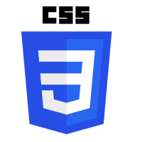
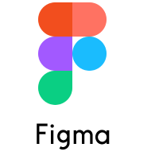

  
  <h1>Hi there, I'm 
    <a href="www.linkedin.com/in/rohinipatare/">
    Rohini Patare
  </a> </h1>

## :woman_technologist: About Me :
I am a Front-End Developer with UI/UX design skills  from India.
- :telescope: I’m a Front-End Web Developer and contributing to frontend and backend for building web applications.

- :seedling: Exploring UI/UX Web & Mobile Designing.

- :zap: In my free time, I solve problems on GeeksforGeeks, Leetcode and read tech articles.

- :mailbox:How to reach me: 

##  :hammer_and_wrench: Languages and Tools :

### Development Skills

  
  
  
  
  
  
  

  
  
  
  
  

### Database

  
  

